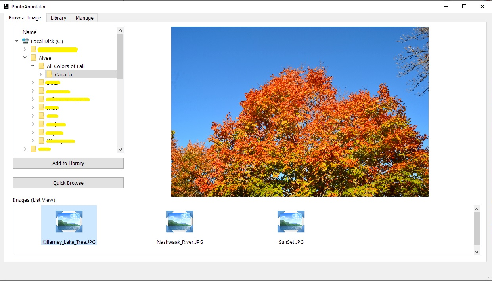
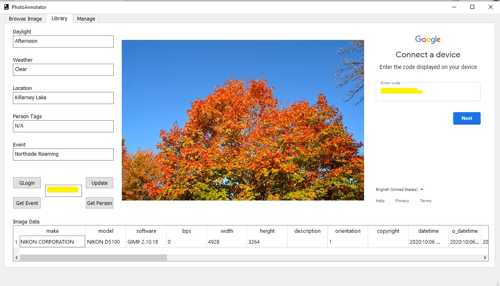
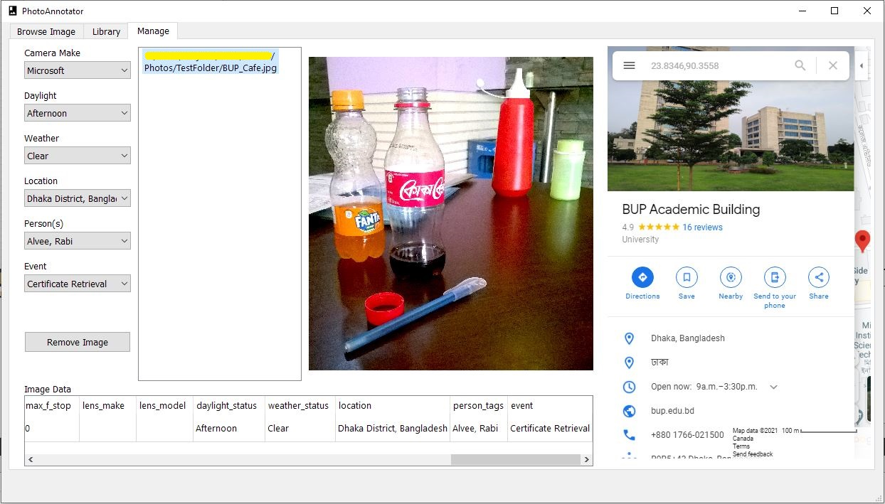

# Photo-Annotator

Photo-Annotator is a photo management application that derives information of location, daylight, weather, event name, and persons related to a photo through external application programming interfaces (API) and libraries from the respective image's metadata. Photos can be sought & viewed efficiently through these information i.e. the location or event on which a particular photo was taken.

## Screenshots

## Prerequisites

OpenCV 2.4.136 and a custom Haar-Cascade Classifier model (.xml).

## Build

The program can be built after configured using QT Creator.

## Tech/ Framework

- QT
- C++
- OpenCV 2.4.136

## APIs

- Sunrise-Sunset API
- Google Calendar API
- Google Geocoding API
- Weatherbit API

## License

This project is licensed under the MIT License - see the LICENSE.md file for details.
